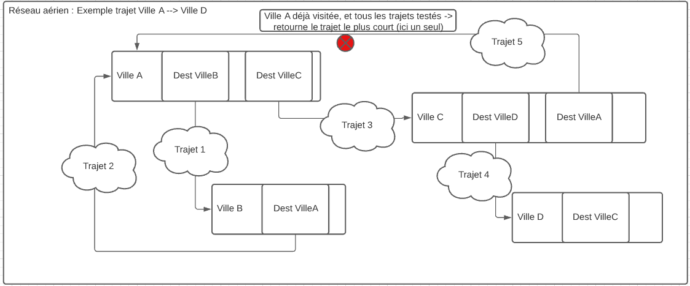

Compte-Rendu : Exploration algorithmique d'un problème
===
Accessibilité dans un réseau aérien :
---

</br>

## Table des matières

* 1.[Description des implémentations choisi :](#chapter1) 
    * 1.1 [Méthode N°1](#section_1_1)
    * 1.2 [Méthode N°2](#section_1_2)
    * 1.3 [UML](#section_1_3)
* 2.[Explication des algorithmes développés](#chapter2)
    * 2.1 [Méthode N°1](#section_2_1)
    * 2.2 [Méthode N°2](#section_2_2)
* 3.[Comparaison de complexité](#chapter3)
    * 3.1 [Méthode N°1](#section_3_1)
    * 3.2 [Méthode N°2](#section_3_2)
    * 3.3 [Pertinance des algorithmes](#section_3_3)
* 4.[Peut-il résoudre d'autres problèmes ?](#chapter4)

</br>
</br>
</br>
</br>

## Description des implémentations choisi <a class="anchor" id="#chapter1"></a>

#### __Méthode N°1__ <a class="anchor" id="section_1_1"></a>

Choix de l'implémentation :

Pour la première implémentation nous avons choisi la représentation N°1 donnée par le sujet, la liste de villes. Pour chaque ville, nous faisons correspondre, dans un vecteur de pointeur de ville, la liste des destinations possibles. Nous remplissons ce vector en demandant pour chaque ville déjà existante s'il existe un vol direct vers cet aéroport. Nous ajoutions alors les villes de destination au vector qui correspond à la vile de départ.

L'avantage d'utiliser les vectors est qu'ils permettent de les remplir dynamiquement, nous définition les vectors vide, puis les remplissons au fur et à mesure.

Les vectors contenants les villes existantes et les destinations sont des pointeurs de villes car cela était, d'après nous, beaucoup plus léger de passer en paramètre un vecteur de pointeur plutôt que les villes en elle-même. Au risque de rendre le code moins clair avec l'utilisation d'itérateur sur des pointeurs pour les appels de fonctions.

Nous avons aussi implémenté une liste de villes par défaut afin de facilement tester les potentielles erreurs du programme ou bien simplement faciliter l'utilisation du programme.

#### __Méthode N°2__ <a class="anchor" id="section_1_2"></a>

Choix de l'implémentation :

Pour la seconde implémentation nous avons choisi d'utiliser une modélisation qui nous semblait la plus différente de la première à savoir la matrice (le modèle 4 proposé sur le sujet). Pour représenter ce modèle de réseau, nous avons d'abord réfléchi à ce qu'il devait contenir, nous avons conclus qu'il pourrait être intéressant de créer une classe dérivée du réseau du premier modèle. En effet notre classe ```Network``` était composé d'un vecteur de ville qui nous était aussi utile pour la matrice. Les méthodes de construction, d'affichage et de recherche dans le réseau était aussi nécessaire pour le modèle avec matrice et nécessitait juste une surcharge.

Cette classe fille devait juste contenir en plus les liaisons entre les villes, et non pas qu'elles soient contenu dans les villes comme pour le précédent modèle. Nous avons donc créé une classe abstraite pour les villes et chaque modèle à sa propre classe fille de ville. Dans ce modèle notre ville contient juste un numéro (son emplacement dans la matrice) en plus d'un nom. 

Notre matrice est composé d'un vecteur de vecteur de booléen. Chaque indice du premier vecteur représente une ville. Chaque vecteur inclut dans le premier fait la même taille que celui-ci, pour une ville cela représente donc les destinations auquelles elle a accès. Chaque booléen contenu dans ce deuxième vecteur est évalué à ```true``` si un vol est disponible vers la ville de l'indice correspondant. On peut simboliser la matrice de la façon suivante :


</br>

#### __UML__ <a class="anchor" id="section_1_3"></a>


</br>
</br>
</br>
</br>

## Explication des algorithmes développés <a class="anchor" id="chapter2"></a>

#### __Méthode N°1__  :<a class="anchor" id="section_2_1"></a>

L'agorithme développer pour connaître si un vol est possible, et de savoir en combien de coût si le vol est possible est basé sur une fonction récursive. La fonction commence par tester si nous ne sommes pas déjà sur place. Puis vérifie si nous sommes déjà passé par cette ville. Si aucun des tests n'est vérifié, alors elle apelle récursivement chacune des destinations possibles de la ville actuelle.
</br>
</br>
Pour mieux comprendre suivons le processus à travers un exemple simple :


Dans cette exemple nous souhaitons atteindre la **_Ville D_** depuis la **_Ville A_**.

Dans un premier tant on test si nous sommes arrivé, ce n'est pas le cas. On test si nous sommes déjà passer par cette ville, ce n'est pas le cas non plus. Alors nous allons à la **_Ville B_**, première destination de la **_Ville A_**. (Trajet 1)

</br>
</br>
</br>


Nous refaisons les vérifications : Sommes-nous arrivé ? Non. Sommes-nous déjà passer par la ? Non.

On se déplace vers la seule destination possible : la **_Villa A_** (Trajet 2).

Lors des tests, on se rend compte que nous sommes déjà passer par là. Il nous faut donc nous arrêter (pour éviter de tourner en rond) et retourner vers les villes non-visiter accessible par **_Ville B_**. 

Dans notre cas **_Ville B_** n'a que **_Ville A_** en destination directe. On retourne donc encore en arrière, vers les autres destinations de **_Ville A_**.

</br>
</br>
</br>


On se rend donc dans la **_Ville C_** où nous effectuons les deux tests. Nous ne sommes ni arrivé, ni déjà passé par ici, on continue donc. La prochaine ville est la **_Ville D_**. (Trajet 3)

</br>
</br>
</br>


Une fois à la **_Ville D_** le test d'arrivé est validé, on retiens le nombre de coups qu'il nous a fallu. Cependant on ne s'arrête pas, car un chemin plus court existe peut-être. La **_Ville D_** ne mène qu'a la **_Ville C_** qui à déjà été visiter. Il nous reste la deuxième destination de la **_Ville C_**.

</br>
</br>
</br>



On se rend donc à la **_Ville A_** qui est la dernière destination possible. Elle ne respecte évidement pas les tests. On retourne alors le plus petit trajet retenu (il n'y en a qu'un ici).

</br>
</br>
</br>

#### __Méthode N°2__ :<a class="anchor" id="section_2_2"></a>

Pour ce deuxième algorithme nous commençons par demander la ville de départ et la ville d'arrivée. Cette algorithme est lui aussi récursif, avec ces deux données nous initialisons donc le premier tour dans le contexte de la ville de départ. Nous allons illustrer ici aussi notre algorithme par un exemple, admettons que nous voulions aller du point A au point E et que notre matrice puisse être représenté de la manière suivante (les croix représente notre booléen ```true``` c'est à dire lorsque la destination vers la ville est disponible directement):

IMAGEIMAGEIMAGEIMAGEIMAGEIMAGEIMAGEIMAGEIMAGEIMAGEIMAGEIMAGEIMAGE

Pour commencer notre algorithme va regarder si la ville d'arrivée est disponible directement, ce n'est pas le cas donc l'algorithme se relance dans le contexte de la première ville accessible donc B: 

IMAGEIMAGEIMAGEIMAGEIMAGEIMAGEIMAGEIMAGEIMAGEIMAGEIMAGEIMAGEIMAGE

L'algorithme detecte qu'aucune ville n'est accessible, il revient donc dans le contexte précédent (A) est passe à la ville accessible suivante donc C:

IMAGEIMAGEIMAGEIMAGEIMAGEIMAGEIMAGEIMAGEIMAGEIMAGEIMAGEIMAGEIMAGE

L'algorithme mémorise à chaque tour le chemin actuel, à cette étape c'est donc **A - C**. La premier ville accessible est **A**, comme elle est déjà dans le chemin mémorisé elle est donc sauté. Le contexte suivant est donc D: 

IMAGEIMAGEIMAGEIMAGEIMAGEIMAGEIMAGEIMAGEIMAGEIMAGEIMAGEIMAGEIMAGE

L'algorithme détecte que la ville d'arrivée est disponible, il sauvegarde le chemin qui est donc actuellement ici **A - C - D**. Ensuite il remonte les contexte jusqu'à en trouver un pour qui il restait des chemins à explorer, ici il remonte donc jusqu'au contexte A:

IMAGEIMAGEIMAGEIMAGEIMAGEIMAGEIMAGEIMAGEIMAGEIMAGEIMAGEIMAGEIMAGE

Nous avions déjà parcouru les contextes **B** et **C**, le suivant est donc D:

IMAGEIMAGEIMAGEIMAGEIMAGEIMAGEIMAGEIMAGEIMAGEIMAGEIMAGEIMAGEIMAGE

La ville d'arrivée est ici aussi accessible directement, comme précédement le chemin (**A - D** est sauvegardé) et on remonte les contextes jusqu'à en trouver un pour qui il reste des contextes à explorer. Ici tout a été fait, on peut donc comparer les différents chemins sauvegardés pour ne garder que le plus court, ici on renvoie donc le chemin **A - D**, c'est exactement ce que nous voulions.

</br>
</br>
</br>
</br>

### Comparaison de complexité <a class="anchor" id="chapter3"></a>

#### __Méthode N°1__ :<a class="anchor" id="section_3_1"></a>

La fonction de recherche est divisé en différentes étapes. En premier lieu elle lance une boucle qui va parcrourir chaque ville présente dans le réseau. A chaque nouveau tour la prochaine ville présente dans le réseau est pointé. Cependant avant de terminer la boucle, la fonction de recherche est appellé de manière récursive sur chacune des villes accessibles depuis la ville pointé dans la boucle.

On se retrouve donc avec une boucle itérative faisant **_n_** opérations, de plus on effectue 2 tests **_(+2)_**, ainsi que 2 potentiels opérations **_(+2)_**. Puis lors de chaque tour de boucle, on fait un appelle récursif **_n-1_** fois, car la ville déjà visiter ne sera pas revisité par l'algo (test n°1). 

On se retrouve donc avec une compléxité de **_(n * 2 + 4) * n-1_**

#### __Méthode N°2__ :<a class="anchor" id="section_3_2"></a>


#### __Pertinance des algorithmes__  :<a class="anchor" id="section_3_3"></a>

</br>
</br>
</br>
</br>

### Peut-il résoudre d'autres problème ? <a class="anchor" id="chapter4"></a>

Nous pensons que nos implémentations peuvent être implémentées dans de nombreux cas. L'objectif de ce programme est de savoir s'il est possible d'arriver à un point B à partir d'un point A. Dans le cas présent nous parlons de villes et d'aéroports, cependant il est aussi possible de l'appliquer à des situations différentes. 

En effet nous pouvons prendre l'exemple d'une recette de cuisine. A partir d'une tomate (point A), nous pouvons, à travers plusieurs étapes, obtenir une salade (point B). Cela permettrait de montrer à l'utilisateur les différentes étapes de la transformation de la tomate pour arriver à la fin de la recette. 

D'autres implémentations peuvent être envisagées notamment pour la création d'objets techniques avec de nombreuses étapes, nous pouvons prendre l'exemple du jeu "Minecraft" qui possède un arbre de création conséquent et représente parfaitement cette situation.


